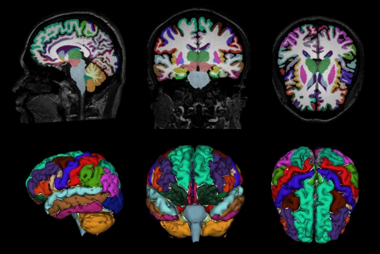

# t1_mri_nifti_segmentation
## Overview  
This project provides a **Python-based GUI** developed with **PyQt** to perform **brain MRI segmentation** using a **U-Net CNN architecture**. The deep learning model is inspired by **FastSurfer** and is detailed in a paper that won the **Student Scientific Communication Session** at the **National University of Science and Technology Politehnica Bucharest**.  
[Read the Paper Here](https://upb.ro/wp-content/uploads/2022/05/Metode-Optimizate-De-Segmentare-A-Imaginilor-RMN.pdf) 

The GUI allows users to load MRI scans, perform segmentation, and visualize results interactively.  



---

## Features  
- Interactive segmentation of brain MRI scans.  
- Preloaded dataset with 4 test subjects and their annotations.  
- Uses a **color lookup table (LUT)** to map segmentation classes (consult `data/FastSurfer_ColorLUT_95_classes.tsv`).  
- Efficient segmentation powered by a U-Net model stored in `src/model`.  

---

## Installation  

1. **Clone the repository:**  
   ```bash
   git clone https://github.com/t1_mri_nifti_segmentation.git  
   cd t1_mri_nifti_segmentation
   ```
2. **Install dependencies:**
   Ensure Python 3.10+ is installed, then run:  
   ```bash  
   pip install -r requirements.txt
   ```

---

## Usage
To lunch the GUI, simply run:
```bash
python main.py
```

---

## Data Directory 
* Test subjects and their annotations are preloaded in `data/subjects`.
* For segmentation class mapping, refer to `data/FastSurfer_ColorLUT_95_classes.tsv`.

---

## How It Works
Load MRI Scans: Use the GUI to select and load an MRI scan from the test subjects.
Run Segmentation: The U-Net model processes the scan to produce segmentation maps.
Visualize Results: View the segmented regions directly in the GUI.

---

## Credits
* Architecture: [FastSurfer](https://deep-mi.org/research/fastsurfer/)
